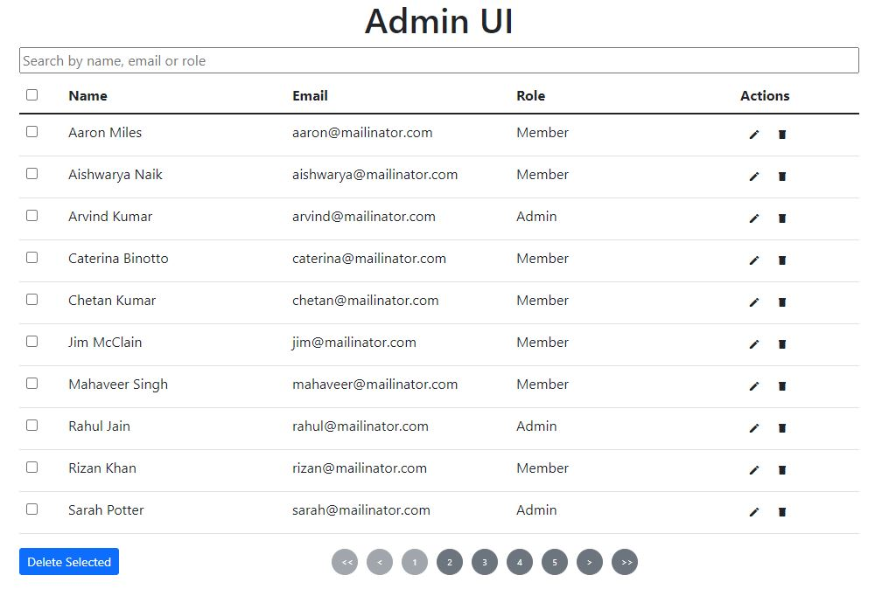

## Admin UI

An application used to fetch the user data from rest API and display in tabular format on the UI for admin activities such as Search User, Edit user or delete user. This has been built with React, hooks, JavaScript, and CSS. Also Admin can multi select the rows

#### Screenshot :

#### Live Server Url - https://admin-dashboard-123.netlify.app/

## Installation and Setup Instructions

Clone down this repository. You will need `node` and `npm` installed globally on your machine.

Installation:

`npm install`

To Run Test Suite:

`npm test`

To Start Server:

`npm start`

To Visit App:

`localhost:3000/`

## Challenge

- Invoke a API endpoint in order to get the user data. The loaded data should be displyed in tabular format.
- There should be a search bar that can filter on any property/column.
- The admin should be able to edit or delete the rows
- Implement the dynamic pagination based on the number of available records.
- Admin should be able to select mutiple rows which can be deleted at once using "Delete Selected" button
- Checkbox on the top left is a shortcut to select or deselect all displayed rows. This should only apply to the ten rows displayed in the current page, and not all 50 rows

## Solution :

Solution contains two main Components and one custom react hook.

1.  Input - Provides input field in order to filter rows.
2.  Table - Create a table structure
3.  useAxiosGet - Custom hook to Fetch the data

#### 1) Input Components

It provides the ability to enter any text which will eventually pass to Table Component as a props to apply filter.

#### 2) Table Components

Based on a Props provided to this component it will dynamically gives the output (Ex. Table Coumns, Table Rows and Pagination)

Table can be customise as per the requirement by passing various props as mention below.

- tableRowObjects [Required] - [Default - [ ] ] - [DataType - Object Array]
  - Array of all row objects
- tableColumns [Required] - [Default - [ ] ] - [DataType - Object Array]
  - Array of Column which needs to be displayed. Each object in array should have three propery as
    - title - The name of column needs to be display.
    - dataIndex - Respective identifiar from the tableRowObjects data
    - key - unique value for each column.
  - Ex - [{"title": "Email","dataIndex": "email","key": "email"},]

- tableRowsUniqueIdentifier [Required] - [Default - "id"] - [DataType - String]
  - The identifier from the tableRowObjects by which each row can be identify uniquely.
- tableSearch - [Optional] - [Default -""] - [DataType - String]
  - The filter which needs to be applied on the table data. If not provided, table will contain all the rows.
-  tableRowCheckboxRequired -[Optional] - [Default true] -[DataType - boolean]
    - This gives the ability to generate the Row Selection Checkbox. If we dont want the selection checkbox we need to pass a props value as false.
- tableRowEditRequired - [Optional] [Default true] - [DataType - boolean]
    -  This gives the ability to have a edit/save option for each row. If not required, we need to pass props value as false.
 - tableRowDeleteRequired - [Optional] [Default true] - [DataType - boolean]
    -  This gives the ability to have a delete option for each row. If not required, we need to pass props value as false.
- tableRowsPerPage - [Optional] - [Default - 10] - [Datatype - Number] 
    - This gives the abiliy to display number of rows on the table. We can pass any number as a props value to display respective number of rows per page.
- maxNoOfButtonsOnPagination - [Optional] - [Default 5] - [Datatype - Number] 
    -  This gives ability to have maximum numbers of page numbers on pagination list. We can pass any number as a props value in order to have perticular number of pagination buttons.

Note - In order to manipulate the table property, all the properties have placed under /src/config.json

#### 3) useAxiosGet

Custtom hook to invoke an axios get request over an api. The useAxiosGet hook accepts a API endpoint, and returns a object as below:
{axiosGetResponse, isLoading, isError }

#### Built with

- HTML5 markup
- CSS3, Flexbox
- React - JS library
- React-(useReducer and useContect) - State Management
- Test - Jest

#### Author

- Vishal Nalawade (vishalnalawade42@gmail.com)
